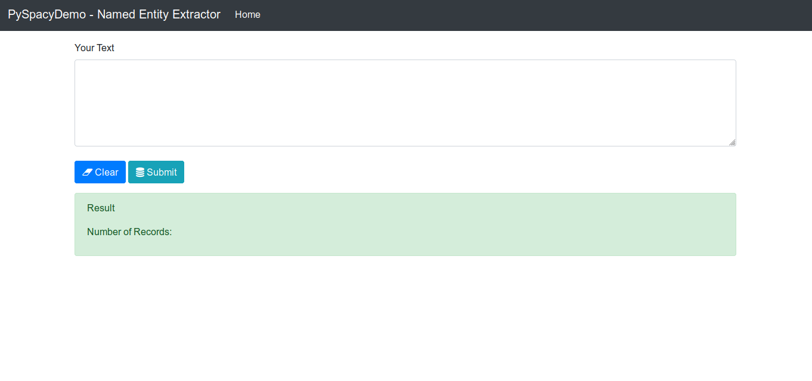
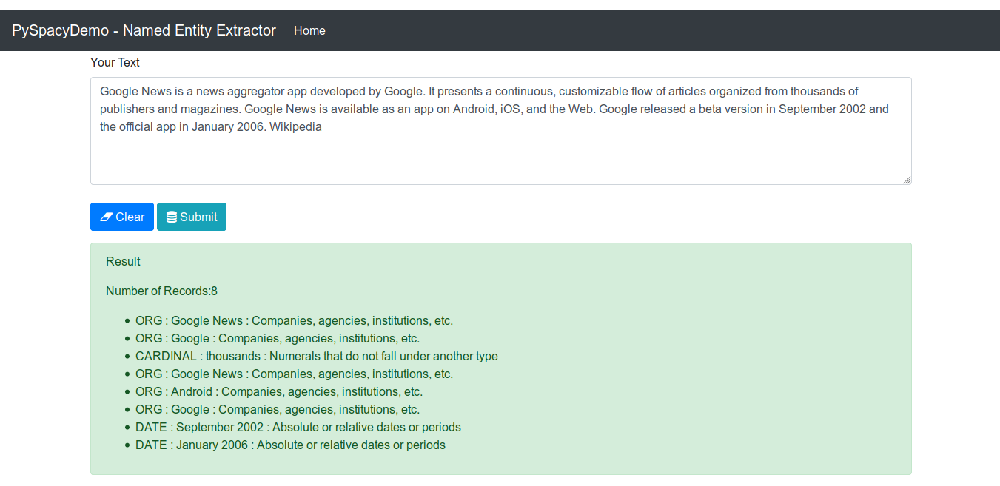

# PySpacyDemo
This is demo for extracting named entities from text using Spacy library.

<h2> Intial Screen </h2>

<h2> Output with text </h2>

We have passed text input and it will give us entiies out of text.

